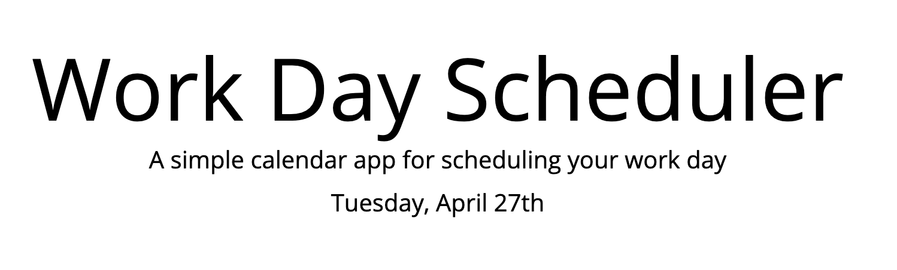
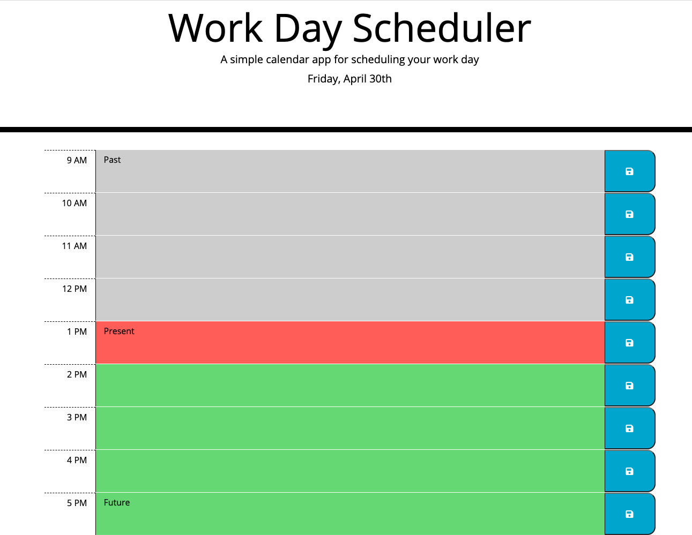

# Work Day Scheduler
The purpose of this project is to provide an employee with a daily planner so that he/she can manage time effectively. 

## Display Date
The first requirement of this webpage is to display the current date at the top of the calendar. This was done using moment JS. See below: 
 

## Time Blocks
The next requirement of this scheduler was to provide time blocks with standard business hours (9AM - 5PM). These time blocks are color coded to respresent if the current time is past (gray), present (red), or future (green). See below: 
 

## Save and Refresh
The final requirements of this webpage is create a save button for each time block that saves the user input - even when the page is refreshed. 
